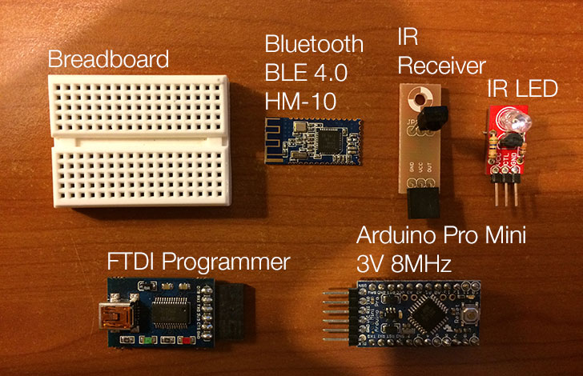

anymotuino
==========

Anymote Arduino Clone

What is it?
-----------

__anymotuino__ is an Arduino clone of our __AnyMote__ device (you can follow our KickStarter campaign [here](https://www.kickstarter.com/projects/1635386542/anymote-home-your-phone-the-ultimate-universal-rem)).

It behaves almost exactly as our __AnyMote__ device, although it lacks the optimisations we were able to integrate in our custom board and firmware.

__anymotuino__ follows the same protocol as __AnyMote__, so you can safely use it with our AnyMote [iOS](#coming-soon) and [Android](https://play.google.com/store/apps/details?id=com.remotefairy&hl=en) applications.

What hardware do I need to build it? (Bill Of Materials)
--------------------------------------------------------

You can basically use any Arduino board along with a Bluetooth LE 4.0 compatible serial data module and InfraRed LED, but for the purposes of this example, we have chosen to use an Arduino Pro Mini (3.3V version) and an HM-10 BLE board, mainly to keep things nice and compact, while running on 2x AA batteries.

Here's the Bill Of Materials for this project:

1. [Arduino Pro Mini – 3.3V, 8MHz version](https://www.sparkfun.com/products/11114) (there's also a 5V, 16MHz version, but we only need 3V)
2. [HM-10 BLE 4.0 module](http://www.fasttech.com/product/1292002-ti-cc2540-cc2541-bluetooth-4-0-ble-2540-2541) (based on TI's powerful CC2540 BLE chip)
3. [Max Power IR LED Kit](https://www.sparkfun.com/products/10732) (Any IR LED will do, but this kit allows you to get the most power out of your Arduino for the best range)
4. [IR Receiver](http://www.adafruit.com/products/157?&main_page=product_info&cPath=35&products_id=157) (used for IR recording, if you need it)
5. [Mini Breadboard](https://www.sparkfun.com/products/12047)
6. Wires
7. [2xAA Battery Enclosure](https://www.sparkfun.com/products/9543) (I recommend buying one with a switch on it)

What software do I need to run it?
----------------------------------

You need Arduino 1.0+ obviously, and you also need Ken Shirriff's [IRRemote library](https://github.com/shirriff/Arduino-IRremote).

